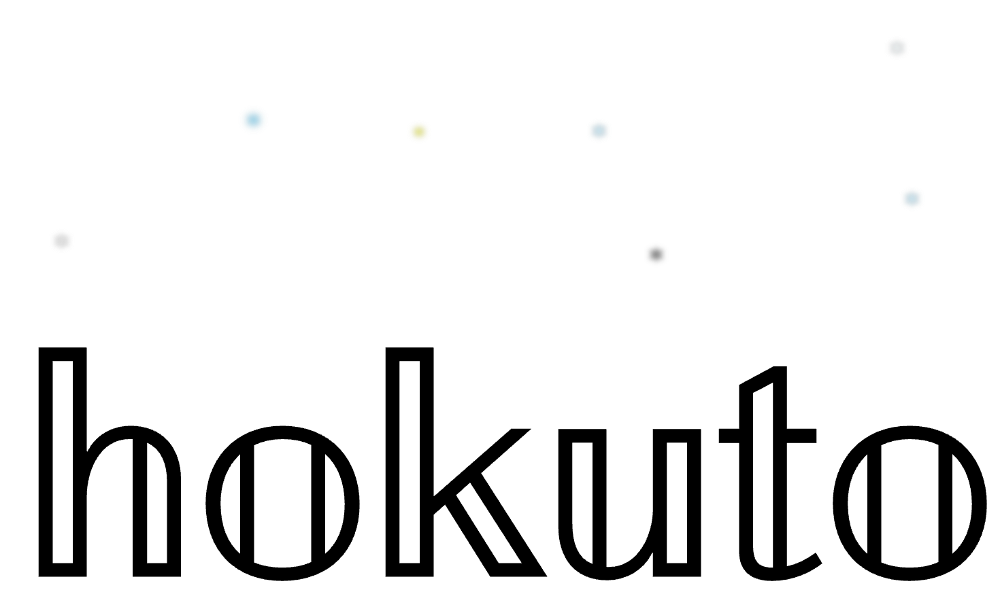

<div style="width:735px;height:448px;pointer-events: none;background-color:#FFFFFF00;position:relative;overflow:hidden;"><div style="filter:blur(0px);;z-index:1;font-family:Verdana;font-weight:400;color:#000000;opacity:1;position:absolute;transform-origin:center center;transform:translate(74.5px,335.5px) scale(12);font-size:20px" data-id="h">𝕙</div><div style="filter:blur(0px);;z-index:1;font-family:Verdana;font-weight:400;color:#000000;opacity:1;position:absolute;transform-origin:center center;transform:translate(202.5px,335.5px) scale(12);font-size:20px" data-id="o">𝕠</div><div style="filter:blur(0px);;z-index:1;font-family:Verdana;font-weight:400;color:#000000;opacity:1;position:absolute;transform-origin:center center;transform:translate(330.5px,335.5px) scale(12);font-size:20px" data-id="k">𝕜</div><div style="filter:blur(0px);;z-index:1;font-family:Verdana;font-weight:400;color:#000000;opacity:1;position:absolute;transform-origin:center center;transform:translate(458.5px,335.5px) scale(12);font-size:20px" data-id="u">𝕦</div><div style="filter:blur(0px);;z-index:1;font-family:Verdana;font-weight:400;color:#000000;opacity:1;position:absolute;transform-origin:center center;transform:translate(562.5px,335.5px) scale(12);font-size:20px" data-id="t">𝕥</div><div style="filter:blur(0px);;z-index:1;font-family:Verdana;font-weight:400;color:#000000;opacity:1;position:absolute;transform-origin:center center;transform:translate(663.5px,335.5px) scale(12);font-size:20px" data-id="o1">𝕠</div><div style="filter:blur(0px);;z-index:1;font-family:Verdana;font-weight:400;color:#ffffff;opacity:1;position:absolute;transform-origin:center center;transform:translate(653px,33px);font-size:20px" data-id="s1">*</div><div style="filter:blur(0px);;z-index:2;font-family:Verdana;font-weight:400;color:#ffffff;opacity:1;position:absolute;transform-origin:center center;transform:translate(664px,144px);font-size:20px" data-id="s2">*</div><div style="filter:blur(0px);;z-index:2;font-family:Verdana;font-weight:400;color:#ffffff;opacity:1;position:absolute;transform-origin:center center;transform:translate(476px,185px);font-size:20px" data-id="s3">*</div><div style="filter:blur(0px);;z-index:2;font-family:Verdana;font-weight:400;color:#ffffff;opacity:1;position:absolute;transform-origin:center center;transform:translate(434px,94px);font-size:20px" data-id="s4">*</div><div style="filter:blur(0px);;z-index:2;font-family:Verdana;font-weight:400;color:#ffffff;opacity:1;position:absolute;transform-origin:center center;transform:translate(303px,94px);font-size:20px" data-id="s5">*</div><div style="filter:blur(0px);;z-index:2;font-family:Verdana;font-weight:400;color:#ffffff;opacity:1;position:absolute;transform-origin:center center;transform:translate(180px,86px);font-size:20px" data-id="s6">*</div><div style="filter:blur(0px);;z-index:2;font-family:Verdana;font-weight:400;color:#ffffff;opacity:1;position:absolute;transform-origin:center center;transform:translate(39px,175px);font-size:20px" data-id="s7">*</div></div>




<small>Experimental dom engine</small>


``` js
hokuto.render({
  state: { n: 50 }
  children: [{
    tag:'span',
    html: function() {
      this.node.innerHTML = this.parent.state.n;
    },
    ref: 'lab'
  },{
    tag: 'input',
    attrs: { type: 'range' },
    onInput: function(e) {
      this.getByRef('lab').innerHTML = e.target.value;
    }
  }]
})
```


  
