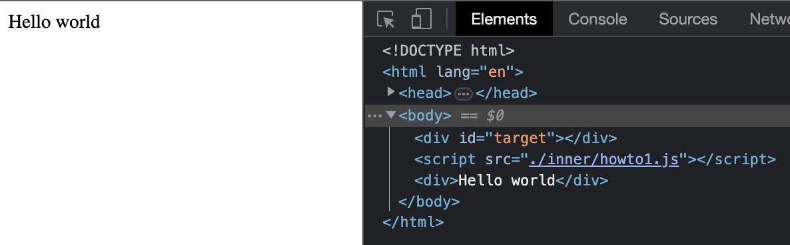

## Hokuto

Experimental dom engine

#### Try it

- install deps  
  `> yarn `
- run unminified  
  `> yarn start`
- navigate to [http://127.0.0.1:3001](http://127.0.0.1:3001)
- edit the `src/sample/index.js` (or `style.css`)

### how to 

Hokuto exposes one single object named `hokuto` which allows you first to render anything u need and then to access some specific features.  

First let's see how to _salute our world_

``` js
hokuto.render({
  text: 'Hello world'
})
```
and get  



easy, but this is not enough right 😂 ?

Below there is a progressive list of examples showing everything is possible using the `hokuto`. After the examples the full API specifications can be found.  
Before proceeding I need to give a sneak peeck of what was passed to the _render_ function. We passed the configuration to render what internally is represented by an instance of a _Unode_, it consists in a object that will contain all is needed to render a fully functional, styles and interactive dom node, subtree included. It accepts:  

- target: where to fenred the node, by default is document.body, but as we will see this parameter is almost alway only used in the very to level config object
- tag: the tag needed, by defaulis a `<div>`, but can be any node which exists at the moment the render function is invoked  
- children: an array of other Unodes

let's make a simple example to clarify:
``` js
hokuto.render({
  tag: 'ul',
  children: [
    { tag: 'li', text: 'one'},
    { tag: 'li', text: 'two'},
    { tag: 'li', text: 'three'},
  ]
})
```
and get  


in this case the root level object will have as target the `document.body` but the inner elements will have as target the node rendered starting from the _Unode_ of their corresponding parent object in the config.  

Ad you can see in the html there's a _div#target_ which comes originally from the html: 
``` html
<body>
    <div id="target"></div>
    <script src="./inner/howto1.js"></script>
</body>
```
and this element is neither removed neither used as target (indeed the default target is the `document.body` and we are not passing _target_ to the root node config)