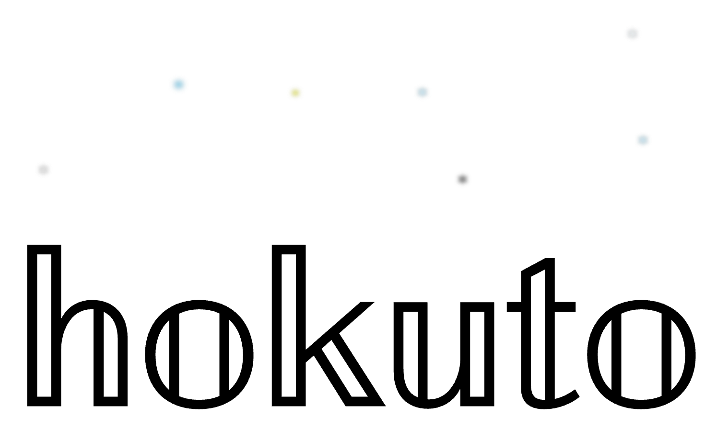

<small>Experimental dom engine</small>


``` js
hokuto.render({
    config: {
        state: { n: 50 },
        children: [{
            tag:'span',
            html: function() {
                this.node.innerHTML = this.parent.state.n;
            },
            ref: 'lab'
        },{
            tag: 'input',
            attrs: { type: 'range' },
            onInput: function(e) {
                this.getByRef('lab').innerHTML = e.target.value;
            }
        }]
    }
})
```


  
